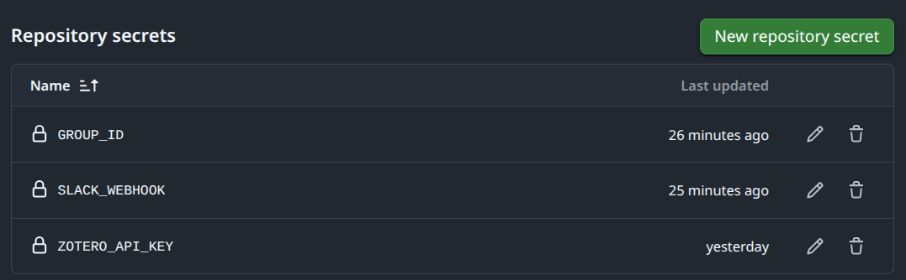

# zotero-slack-alert

This repo/template describes the implementation of a Zotero Slack alert system. It uses the Zotero API to check for new items in a specified library and sends a notification to a Slack channel via a webhook when new items are detected. The automation is set up as a GitHub Action workflow that runs on a schedule (e.g., every hour) to continuously monitor the Zotero library for updates.

It assumes that:

- You have a Zotero account and access to a group/library that you want to monitor. I used this for a group library, but it should work for personal libraries as well.
- You have a Slack workspace and the necessary permissions to create a webhook for a channel.

## Gathering the pieces

To make it work you only need to copy the repo (easy via template button) and then get this information: 

1. A Zotero group/library ID to monitor for new items: to find this, go to your Zotero web library, select the folder, and get the number in the web address, e.g., `https://www.zotero.org/groups/<group_id_number>/...`. this is the **`GROUP_ID`**.

2. A Zotero API key with access to the specified group/library: to create an API key, go to [your Zotero account settings, navigate to the "API Keys" section,](https://www.zotero.org/settings/security#applications) and generate a new key with the appropriate permissions for the group/library you want to monitor. IMPORTANT: select _Read access to groups_ and _Read access to items. Copy the API code in a safe place. This is the **`ZOTERO_API_KEY`**.

3. A Slack webhook URL to send notifications to a Slack channel: install the "Incoming Webhooks" app in your Slack workspace. Go to [this link](https://datasoc-workspace.slack.com/marketplace/A0F7XDUAZ-incoming-webhooks), select the appropriate workspace (up right), then green button "Add to Slack", and in the configuration the important is to select the slack channel where to get the alerts and copy the URL of the webhook. This is the **`SLACK_WEBHOOK`**.

## Now the Secrets

Now you just need to set up these three pieces of information as "Github Secrets" in the repository settings. This way, the GitHub Action workflow can access them securely when it runs. For this: 

- go to the repository on GitHub, click on "Settings" (top right), then "Secrets and variables" > "Actions" > new repository secret
- to set up the `GROUP_ID` secret, enter `GROUP_ID` as the name and paste the group/library ID you found in step 1 as the value in the textbox, then click "Add secret"
- the same for the other two values, so at the end you should have three secrets: `GROUP_ID`, `ZOTERO_API_KEY`, and `SLACK_WEBHOOK`.
  

If you want to test it, you can trigger the workflow manually from the "Actions" tab in your GitHub repository. Just select the workflow and click on "Run workflow". You should see the workflow run and, if there are new items in the Zotero library, a notification should appear in your Slack channel.
That's it! 

